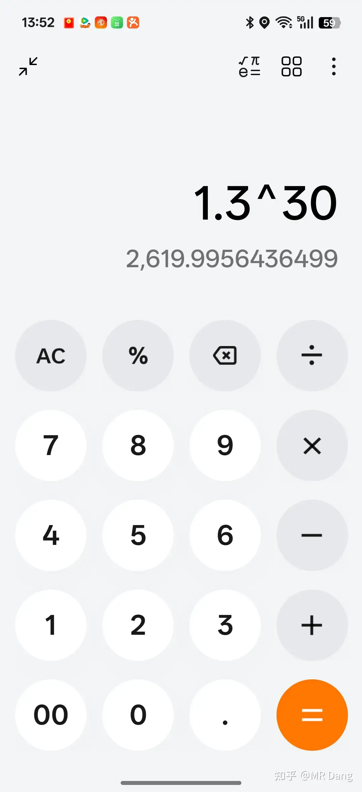

# 家里有个炒股厉害的老爹，建议我学金融继承他的技术?

---

**发布时间**: 2025-09-26 08:59  |  **原文链接**: https://www.zhihu.com/question/1953086236240639565/answer/1954832548850009342  |  **点赞数**: 1112 人赞同

**作者信息**: MR Dang​独立投资人，全网无其他平台，无小号无私域，不接广不卖课

---

## 正文内容

我和你一样，也算股二代，读了985的金融，目前职业股民十多年了。

资金量少的时候也经历过八位数职业炒股。

我的建议是，不要学任何经济类专业！！！

包括会计，金融。

先说会计，不需要全日制系统学习，保守点说，你考个cpa就已经超过90%会计专业本科生的技能了。cpa里的财管已经有基本的投资知识了，cpa里的审计能让你不相信报表，cpa里的战略对投资是最有用的，要学好，cpa里的经济法，税法，会计，对投资没什么帮助。特别是会计，会让你纠结会计科目，执着于会计准则，对一两个会计处理洋洋得意，陷入大多数会计炒股，越炒越赔的怪圈。

再说金融，金融就是数学基础+经济学基础+会计基础+经济法基础。经济学对投资的帮助并没有你想象的那么大，政经就不说了，完全没有帮助，西经主要是宏微观，说来说去就是模型+供求关系，模型一大堆假设，只要一个假设不成立，全盘皆输。最基本的理性人假设都是空中楼阁，建立在上面的模型更是经济学家的自嗨。

会计刚才已经说了，培养不了你的投资视角，因为会计注重会计科目，而不是报表科目，会计准则本身就是人制定的，每年都在变化，相当于你学习的知识每年都在贬值，可以理解么？如果你不持续的学习，你的会计知识会以每年10%的速度减值。

经济法的话，了解即可，对投资的帮助属于锦上添花，没有也行。

所以金融里真正有用的是数学。

那我为什么不直接学数学？？？

你学个数学+cpa+法考

这三个组合起来，进可以职业投资，做个舒服的吃息佬，退可以当金融民工，即使在一二线城市也会有立足之地。比学个什么破金融，破会计强的多。

假设你目前只有1000万可用于投资的资金，搞个高股息组合，比如xx银行+xx电器+xx矿业，一年60万分红，一个月5万是有的。

万一行情好的时候股票再好点，年化10%也不算难。

——————分割线——————

补充一点对老股民的看法。

很多老股民对年化收益率没有很明确的概念，比如30%年化，30年，意味着总收益率是接近2700倍。

当年投入了一万块的话，目前的净值要到2700万才能达到。

还有就是现在的资本市场和30年前不可同日而语，经济形势也不一样。前面30年可以达到30%年化不意味着未来30年也能达到。

实际上以我悲观的预期，以后30年年化10%就已经是人上人了。

以前的方法论放到现在也用不了，比如老股民言必庄家，主力，拉抬等等，阴谋论比较多。诚然，以前的资本市场确实有很多这样的事情，但是如果用这一套套用到现在的资本市场，多半是会吃亏的。

扩展一下：

资本市场的信息可以分为，k线图之类的交易信息，市盈率之类的公开财务信息，还有就是内幕消息。

这三类信息是有等级高低之分的：内幕消息＞财务信息＞交易信息

资本市场也是等级高低之分的：完全有效市场＞强有效市场＞半强＞弱有效市场

弱有效市场里，技术分析无用，基本面分析和内幕消息有用。因为价格里已经包含交易信息了，price in了，你无论是多厉害的画图高手，都没有超额收益，简单的说，所有的短线分析都是自娱自乐的，要么是骗子，要么是幸存者偏差。

半强有效市场里，技术分析无用，基本面分析也无用，内幕消息有用。价格已经包含，基于基本面分析的价值投资无用，只有内幕消息有超额收益

强有效市场里，交易信息无用，基本面分析也无用，连内幕消息都没用了。属于资本市场的乌托邦

美股大概属于半强有效市场。因为很显然如果你知道美联储的内幕消息可以获得超额收益。

a股就有争议了，a股的内幕消息是有用的，短线技术分析无用（所以不要迷信什么短线高手），争议就在于基本面分析有没有用。以目前我的感觉，我是站基本面分析有时候是有用的，也就是a股介于弱有效和半强有效之间。

那么在这样的a股市场里，想获得超额收益，只有两条途经，要么是内幕消息，要么是远超其他交易者的基本面分析水平。

如果既没有内幕消息，也没有过硬的基本面分析水平，就放弃超额收益，直接投被动型指数基金，和中国资本市场共同成长也不错。

而想通过自己的交易天赋在现在的a股市场获得超额收益，无异于缘木求鱼。

---

## 精选评论

> [!comment]- 点击展开评论
>
>
> | 用户 | 时间 | 内容 |
> | :--- | :--- | :--- |
> | 逍遥 |  | 确实如此。学金融的学经济的学会计的很少有炒股炒的好的。原以为专业人做专业的事，是理所当然的事情。但是在股市，这句话完全失效，那么反推只能说，这些学金融学经济学会计的人并不专业，最少对于股市投资而言，一点点都不专业。 |
> | 萌呆小 A |  | 还不如学心理学，研究股民心理，哈哈哈。做会计学经济的是真懂，知道公司值多少钱，但是股民压根不在乎，只要明天能涨，哪怕就是个破旧厕所，股民也会挤破脑袋往里面冲 |
> | 杰森明 |  | 专业的人做专业的事在任何领域都是失效的。只是交易市场准入门槛低，失败者会亏损到死亡。让这个人为塑造的幻觉暴露了而已。任何领域只要是放开准入，失败者会亏损到死亡。顶圈都不会是专业人士。即便是需要的知识量最大的政治，最擅长治理的也从来不是学政治的。更严谨说是公众对"专业"的理解和现实是两码事。 |
> | 独步雲笈 |  | 答主写了这么多，其实最有用的就是告诉大家：这也没用那也没用，其实学的多比没有什么作用。这一行主要靠常识+耐心+坚定的执行力 |
> | 老犀牛 |  | 然后发现，所谓的"常识"并不是那么容易获得的，大多数人其实没啥常识。有常识也未必有耐心和执行力。 |
> | 夏天 |  | 优秀课代表 |
> | Karlno |  | 想赚钱主要靠认知 |
> | 铁笛高吹龙夜吟 |  | 这确实是大实话 |
> | surkingod |  | 少数人赚钱的规则不变，进场的时候多想想自己凭啥是这少数的幸运儿 |
> | xxyy |  | 现在没有法学学位不能考法考。然后如你所说，费相当大的劲去考下cpa大部分也是垃圾知识。金融民工的核心出装是高考分（不考虑VIP），做交易就更自由了，需要学什么就学什么，无需在垃圾知识里浪费时间，即使是数学也要挑有用的学 |
> | 璇张 |  | 确实 那有用范围最大的是什么呢 |
> | Kisssssssss |  | 投行里厉害的人其实不是学金融出身的，大部分是纯理工科，单纯为了炒股没必要学金融 |
> | &nbsp;&nbsp;&nbsp;&nbsp;MR Dang |  | 是的。比如创新药行业分析师，一般是生物工程类的硕博，然后自学金融知识，比金融专业出身的强太多 |
> | 没有关系 |  | 数学越强，在股市里越牛，以前有个大佬搞彩票都能挣 |
> | 老犀牛 |  | 没听说过彩票能稳定盈利的。如果能，那肯定是该彩票的数学模型有缺陷，这个缺陷一旦被打上补丁就拉倒了。任何大众化的彩票，你最终收益的期望值一定低于你的投入。 |
> | 见路不走 |  | 这不就说明人家牛么。我当年也研究彩票，后来发现自己脑子不行。 |
> | OrangeSnow |  | 搞彩票能持续盈利吗怀疑 |
> | 三哥数签签 |  | 每次看到一群人什么金叉死叉就想笑，财务报表可以看看，不可以全信。至于消息，普通人就不用想了，凭什么内幕信息让你看得到？老老实实买被动基金，耐心等待市场便宜的机会。 |
> | 还是不用真名了 |  | 看新闻联播都比看k线有用 |
> | 穿拖鞋去健身 |  | 确实，不如学数学或者计算机 |

---

*本文件由自动脚本从MR Dang知乎页面提取生成*

---

**作者**: MR Dang
**链接**: https://www.zhihu.com/question/1953086236240639565/answer/1954832548850009342
**来源**: 知乎

*著作权归作者所有。商业转载请联系作者获得授权，非商业转载请注明出处。*

---

## 相关阅读

**📖 职业发展系列：**
- [[20250712-普通人全职炒股应该准备多少启动资金或本金？|全职炒股资金准备]] - 全职炒股本金测算

**📚 韭菜保护合集系列：**
- [[20251016-投资新手避坑指南之追热点(万粉特别奉献)|追热点]] - 追热点的正确姿势
- [[20251018-新手投资者避坑指南之有用的小细节|有用的小细节]] - 信息获取渠道推荐

**💡 投资策略：**
- 专业选择建议：数学+CPA+法考
- 有效市场理论
- 超额收益获取途径
- 基本面分析vs技术分析
