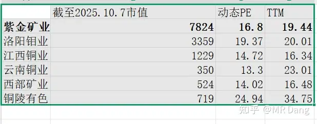

# 铜价暴涨，A股有哪些好的标的值得够买？

---

**发布时间**: 2025-10-07 12:40  |  **原文链接**: https://www.zhihu.com/question/1957811650510984096/answer/1958874184890429688  |  **点赞数**: 538 人赞同

**作者信息**: MR Dang​独立投资人，全网无其他平台，无小号无私域，不接广不卖课

---

## 正文内容

emm，貌似没人回答?浅浅回答一波吧。

鉴于题主圈定了铜和A股这两个范围，那么就从铜的视角看A股的标的。

个人选择的标准:

1.最重要的是资源禀赋，也就是铜矿，衡量维度包括储量，产量，开采成本，地理位置等。

2.其次是公司的估值水平，简单的就是最好的，PE最重要，PB作为不重要参考。

3.考虑边际税收对盈利的影响。

4.公司的管理水平。

5.股息率。

解释一下这几个选择标准，资源禀赋还是管理水平？资源禀赋是无可替代的，管理水平是可以改进的，都考虑投资铜矿企业了，最最最重要的一定是资源禀赋，管理水平难以量化，且影响具有不确定性。

至于PE还是PB？理论上来说轻资产重PE，重资产重PB，有色作为重资产行业是要优先考虑PB的。但我还是那个观点，PB是最好观测且稳定的指标，净资产的波动性小，现在市场上任何一个有色企业的定价都充分考虑了PB，已经PRICE IN了，没什么套利机会的。在铜价屡创新高的背景下，对估值边际影响大的一定是PE，而不是PB。

至于税率和股息率，税率提高上限，股息率确定下限。什么意思呢？铜价提高，提高的部分除了税就是纯利润，税率的高低直接决定了公司收益铜价提升的多寡。股息率则是任何一笔投资的下限保障，是提高你投资容错率的不二法门，即使判断失误，只要股息率够高，早晚有翻身的时候。

一.资源禀赋

先筛选一遍铜产量，5万吨以下的不考虑，选9个股票进入考察池：

1.紫金矿业

2.洛阳钼业

3.江西铜业

4.铜陵有色

5.西部矿业

6.云南铜业

7.藏格矿业

8.金诚信

其实到这一步已经可以用了，大道至简，搞个组合等权重买入持有，就拥有了一个简单的铜ETF

进一步筛选：分成两组，国内组和国际组。

国内组：

铜矿排名：

1.巨龙：2000万吨以上储量，二期达产以后35万吨产量（有二期扩产预期），紫金矿业控股，特点是大，且有西藏地区税收BUFF。

2.玉龙：1000万吨以上储量，15万吨产量（有三期扩产预期），西部矿业控股，特点是成本全国最低，且有西藏地区税收BUFF。

3.德兴：800万吨以上储量，20万吨级产量，江西铜业控股，特点是露天且稳定，缺点是品位低，运输费用高。

4.普朗：480万吨以上储量，10万吨不到的产量，云南铜业控股，地下开采，成本略高。

5.多宝山：300万吨储量，8万吨左右产量，紫金矿业控股，中规中矩，没啥特色。

其他铜矿和以上铜矿规模上有差距，因此经过资源禀赋的初步筛选后，剩下国内组的标的只有4个：

1.紫金矿业（即使只看国内资源，也是绝对龙头，规模效应明显）

2.西部矿业（成本全行业最低）

3.江西铜业 (品位低，成本高，对铜价敏感，顺周期之王，弹性最大）

4.云南铜业（有收购预期，有希望达到10万吨级产能）

不考虑估值的情况下，就是以上排名。

国际组：仅以国内企业控股的铜矿参与排名

1.卡莫阿铜矿：4200万吨以上储量，远期产量90万吨级，紫金矿业控股。

2.TFM:产量45万吨级，洛阳钼业控股。

3.LB：产量40万吨级，五矿资源控股，在港股，不纳入考察。

4.KFM:产量15万吨级，开采成本很低，洛阳钼业控股。

5.紫金矿业塞尔维亚：15万吨级。

6.米拉多：12万吨级，铜陵有色控股。

6.紫金矿业刚果金：10万吨级。

国际组排名：

1.紫金矿业

2.洛阳钼业

3.铜陵有色

综合国内国际组，有资源禀赋的铜矿企业仅剩下6家。

二.估值水平

6家企业拉下估值，鉴于紫金矿业优秀的管理水平和资源禀赋，估值高于紫金矿业的谨慎考虑。

其实没什么好选的了，只剩下紫金矿业，江西铜业，西部矿业三家公司可以选择。

等权重买入，铜属性拉满，风格上覆盖了大市值（紫金），中市值（江铜），小市值（西矿）。

三.管理水平和股息率以及其他

管理水平，紫金》江铜》西矿，三个差距很大，三家公司是三个梯队，代表了好中差。

股息率，西矿》江铜》紫金，三个差距也很大，西矿接近5%，其他两个不到2%。

其他方面，紫金国内部分和西矿主矿区在西藏，有税收优势。

江铜成本高，对铜价弹性更大。

扩产预期，短期，西矿（玉龙三期）》紫金（巨龙二期）》江铜

中长期外扩，紫金》西矿》江铜

江铜还有一个明显的估值优势是PB，这是因为江铜分红比较抠搜攒下来的。

每股经营现金流方面，西矿22的股价，每股有两块多，紫金和江铜30多的股价，每股只有1块左右，西矿的现金流最好。

总的来说，让我只买一个，我会选西矿，相对来说安全性最高，涨的也少，玉龙铜矿成本低，股息率高，就是要忍受低下的管理模式，另外铜冶炼部分非常差，是亏损的。

买两个，就西矿+紫金，紫金不需要解释，紫金本身就是答案。

买三个，就西矿+紫金+江铜，江铜怕的是逆周期，顺周期里谁也不怕。

什么？你不想搞价值投资，就想搞投机，想搏弹性，炒预期，有没有小众的总市值一百亿左右的股票推荐？

有的，兄弟，有的，有两个邪门的铜股票，几乎没人关注的。

一个是河钢资源，一两万吨的产量和正宗的铜股没法比，不过铜也不是人家的主业，目前的估值主要还是铁矿。铜+铁的组合，国内比较少见，因为一般国内的组合是金银铜+铅锌锂。让我买我不买，不过老有人问有没有没有怎么涨的铜股，这个勉强算一个。

一个是中色股份，这股票没有任何铜，但是属于铜股票的铲子股，因为他是专业做建设的，建设各种矿和冶炼厂，逻辑上来讲，随着铜价的提升，以前很多由于经济成本没有开采价值的铜矿就有了开采需求，而这个股票在这方面是很强的，在手有哈萨克斯坦百亿的合同，讲故事是一把好手。本人持有少少量仓位。

为啥叫邪门？因为这些故事，是给别人讲的，是说服他们出高价的理由，不是你高价买的理由。

以上不构成荐股，注意风险！！铜股票全部处于短期内的高点！！！下周开盘就是长阳，短期见顶概率不低！！！！

另外以上只考虑了铜！！实际上现在的有色都是金银铜+铅锌锂，只考虑铜过于险隘！！！！

---

## 精选评论

| 用户 | 时间 | 内容 |
| :--- | :--- | :--- |
| AAA123 |  | 其他都赞同，就是你说看中pe非pb，理由priced in有些异议。铜作为周期股明显pb更重要，万一一个增速不及预期pe就变脸，这样看紫金矿业有点高了，我不会买。另外还需要考虑铜的下游是否可以生成符合时代大趋势的铜箔应用到新能源与AI，这样看虽然铜陵有色资源禀赋并不是最强的，但是成长性它是最高的，所以我看中江西铜业和铜陵有色这两只票 |
| 月城 |  | 江西铜业有个巨大问题就是它的金属冶炼业务是亏损的，毛利率只有不到4%，远远不如紫金矿业洛阳钼业西部矿业！现金流也不太好！ |
| 用户 |  | 紫金矿业主要是还有金矿，这部分的价值也是要考虑进去的，紫金矿业纯看铜其实不合适。 |
| bibabo |  | 周期股本来就是看PB，不过要重置成本算B |
| peng |  | 紫金的黄金溢价更优秀，别忘了它现在金铜对半 |
| 月城 |  | 赞同，两个多月前我就选择了西部，当时看到股息率和性价比还有就是现金流果断就买了，不否认紫金矿业远比它优秀，但是性价比不太好了就退而求其次 |
| 国士九颜 |  | 铜是新时代原油，长期持有 |
| 闻道 |  | 紫金还是得考虑下金矿收益吧，另外大佬怎么看铝 有类似于这篇的回答吗？感谢！ |
| saintluffy |  | 新手八月第一股就是紫金，持股体验太赞了，涨得稳，回调也温和，可惜资金少没多买。 |
| 孤狼dong |  | 学习了选股思路 |
| Aht |  | 西部矿业不如藏格，背靠紫金矿业这颗大树，巨龙铜矿增产空间大，顺带还能抄底碳酸锂 |
| xixi |  | 想买紫金，看中了他的金+铜属性。但是市值太高了，主力不愿意拉升，很纠结 |
| saintluffy |  | 今天看起来是主力出货，散户拉涨停了。。。 |
| 肚子疼 |  | 看了很多回答，总结起来就是各有各优势，但是紫金矿业是中流砥柱 |

---

*本文件由自动脚本从MR Dang知乎页面提取生成*

---

**作者**: MR Dang
**链接**: https://www.zhihu.com/question/1957811650510984096/answer/1958874184890429688
**来源**: 知乎

*著作权归作者所有。商业转载请联系作者获得授权，非商业转载请注明出处。*
