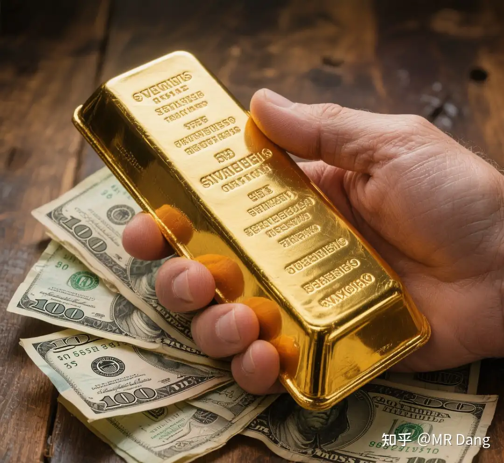

# 黄金投资突然上了枷锁，关于黄金税收对老百姓来说是好是坏呢？

---

**发布时间**: 2025-11-05 07:32  |  **原文链接**: https://www.zhihu.com/question/1968612930045059136/answer/1969305961312270298  |  **点赞数**: 274 人赞同

**作者信息**: MR Dang​独立投资人，全网无其他平台，无小号无私域，不接广不卖课

---

## 正文内容

热度过了，可以说下我对普通人的建议：

要么别买黄金，要么就买实体金条。

每次给人配置资产时，如果我觉得有必要配置黄金，我都会在黄金前面加上实体两个字，必须粗体突出。

为什么呢？因为黄金的作用就是避险。

什么是避险？就是极端情况下的最后一根稻草。

你如果不理解什么叫极端情况，可以想想巨大的自然灾害后的样子(比如大地震)。

电力，通讯，公共交通网络全部瘫痪后。

黄金是依然可以自由流通的一般等价物。

有人会告诉你，都什么年代了，积存金，黄金etf，纸黄金，流通性又好，交易手续费又低，为什么不买呢？

我说几个事：

1，1816年，英国通过《金本位制度方案》，规定1英镑=7.3克黄金。

同时期，由于中国的产品丝绸茶叶等，在西方广受欢迎，中国产生巨大的贸易顺差。

而中国当时是银本位制，所以大量白银流入到中国。

欧洲一看这不行啊，就有了后来的鸦片战争和丧权辱国(相关历史国人应该很熟了，就不展开了)，本质就是为了把白银再弄回去。

在签订条约的时候，最出名的就是《辛丑条约》的庚子赔款，啥时间呢，1902——1935，还有个专门的名词，叫“镑亏”：

本来签了4.5亿两白银的赔款，但是因为英镑和黄金挂钩，黄金升值，白银贬值，最后算上利息，一共赔了9.8亿两白银。

巧合的是，中国马上要赔完的时候，1931年，英国放弃金本位制度，英镑和黄金脱钩。

黄金幻觉维持时间=115年

2，1944年，布雷顿森林体系建立，美元挂钩黄金，35美元=1盎司。

1971年8月，尼克松宣布挂钩结束。

黄金幻觉维持时间=27年

3，1948年8月，光头宣布1金圆券=0.222克黄金。

1949年7月，金圆券变成废纸。

黄金幻觉维持时间=300天

每隔一段时间，总会有人跳出来，告诉别人自己设计的系统有多么合理，自己的纸为什么会等于你的黄金。

不过只要你学过辩证唯物主义，你就应当知道，黄金就是黄金，纸就是纸，黄金不会变成纸，纸也不会变成黄金。

你可以用你的纸去换别人的黄金，但是别拿你的黄金去换别人的纸。

不要试图去了解纸有什么优越性，纸再优越都是纸，黄金在粪坑里也是黄金。

不要去欣赏纸上的图案，图案再漂亮，那也不是炼成阵，世界上没有炼金术。

这件事情的重点，根本就不是到底对哪个环节征税了，研究那个有什么用呢？

今天能对这个环节征，明天就能对那个环节征。

征税本身就是信号。

枪响了第一反应应该是躲起来藏好。

而不是去争论子弹到底落在哪里了。

那是傻狍子才会干的事情。

还有人还把黄金分为投资和非投资：纸黄金是金融投资的，实物黄金是非金融投资的。

让人看了想笑，可那明明就是纸和黄金的区别啊，兄弟。

一个不算冷的热知识，但是我发现很多人还不知道：

《中华人民共和国金银管理条例》第九条规定：“从事金银生产的厂矿企业、农村社队、部队和个人所采炼的金银，必须全部交售给中国人民银行，不得自行销售、交换和留用。”

上金所的交易环节是交售给央行的后续环节。

什么东西是珍贵的，自行判断吧。

至于怎么买金条。。

以经验来说工农中建四大行里，建设银行的投资金条最便宜，目前应该不到920。

那还有没有更便宜的黄金呢？

有的，兄弟，有的。

如果你恰好路过香港，又恰好路过上环，又恰好看见金城金条之类的金店，进去转一圈身上又恰好多了50克黄金，恰好顶着限额入关了，这很合理吧(一般情况下一克能便宜5到10块，套利空间不大，没必要特意跑一趟)

你要头铁买国内1100多的首饰金来保值增值，那我只能说算你狠。

一个喜欢保护韭菜的博主，希望大家少踩坑多赚钱。

---

## 精选评论

| 用户 | 时间 | 内容 |
| :--- | :--- | :--- |
| 边缘人 |  | 顺便提一下，对于粉末或化合物状态的黄金，金属探测器无效。 |
| &nbsp;&nbsp;&nbsp;&nbsp;MR Dang |  | 这个就叫专业 |
| 开心 |  | 和平时，国家对黄金买卖管控较松；动荡时，国家就会通过购买时的名册，直接强行回收（历史上，国内国外都是这样），毕竟动荡时国家也需要黄金给政府纸币背书。所以我的看法是，买实物黄金，也是给国家暂存着。 |
| 青蛙 |  | 非常赞同，现在很多说只买银行的实物金条的，都是自作聪明，黄金对于老百姓真正的价值在于不记名，你买金条是要登记个人真实信息的，本质你只是一个暂时的保管者； 你如果是一个末日准备者（其实在中国这地方，不是末日你也压根用不到黄金来保值），现在买黄金最好是用现金分批、多地购买黄金首饰，用现金交易（不留存交易记录和个人信息） |
| violet666 |  | 看数量吧，大户们容易补盯上，我们这三瓜两枣的，应该还好。 |
| 我反正萌新一个 |  | 不一定强制征收，但是可能会强制压低回收价，到时候只有黄金没有钱，你只能被迫低价卖 |
| vidi |  | 但是架不住你群体大，反抗小好收割啊 |
| 顺民 |  | 大户们不好拿捏，小韭是最先收割的 |
| 杰洛特今天打什么 |  | dang佬，我得指出您一个小问题，庚子赔款是辛丑条约的，不是马关条约的 |
| &nbsp;&nbsp;&nbsp;&nbsp;MR Dang |  | 理科生哭了，马上改 |
| 鸵鸟啊鸵鸟 |  | 今天7点半就更了啊，上班的牛马都赶不上了 |
| &nbsp;&nbsp;&nbsp;&nbsp;MR Dang |  | 哈哈，今天孩子上学早，顺带起的早了 |
| 庆历长官 |  | dang老师🙋我我我，对买实体黄金研究比较大，我经常买首饰金，618或者双11，配合银行卡优惠和京东淘宝优惠券，首饰金卖的往往能做到比大盘价便宜很多。 |
| 庆历长官 |  | 对的，项链、戒指买的比较多，一定要旗舰店买，足金999有保障，品牌的话周六福、周生生、曼卡龙、潮宏基买的比较多，因为他们一般都是和买的克数一样或者多个0.01-0.1克。还有周大生，但是有个问题是周大生每次都少我克数，每次都是少我0.01-0.1克，找他们客服吧又说在国家规定的偏差范围，不给补。就让人感觉和饭里吃到了苍蝇一样，挺难受的。 |
| 庆历长官 |  | 比较复杂，什么信用卡优惠、黄金优惠券、淘金币抵扣，返利之类的，研究以后学会了发现比炒股有意思 |
| 木向阳 |  | 请问老师，按照之前您写的控制仓位逻辑，按照今天下跌加昨天下跌，累计5%，就追加1%，是这个意思吧？宝丰，盐湖，南山，川恒，芭田，云天化。基本上是开超市了。 |
| &nbsp;&nbsp;&nbsp;&nbsp;MR Dang |  | 嗯，可以 |
| 物理课了 |  | 赚麻了吧兄弟 |
| Csyw |  | 这样看来即使是为了投资而非避险，纸黄金和etf也不如黄金股是么，既享受上涨行情也能一定程度避免黄金幻觉崩塌的风险 |

---

*本文件由自动脚本从MR Dang知乎页面提取生成*

---

**作者**: MR Dang
**链接**: https://www.zhihu.com/question/1968612930045059136/answer/1969305961312270298
**来源**: 知乎

*著作权归作者所有。商业转载请联系作者获得授权，非商业转载请注明出处。*
