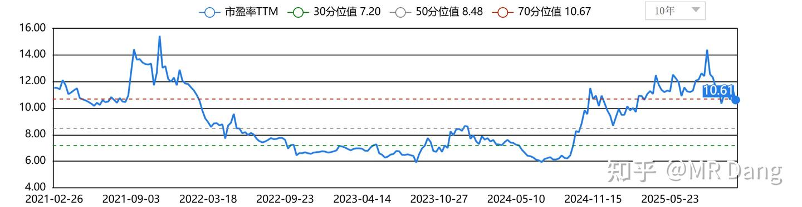
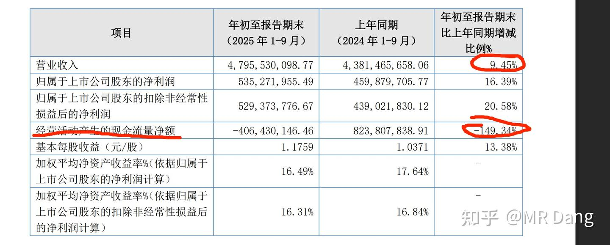
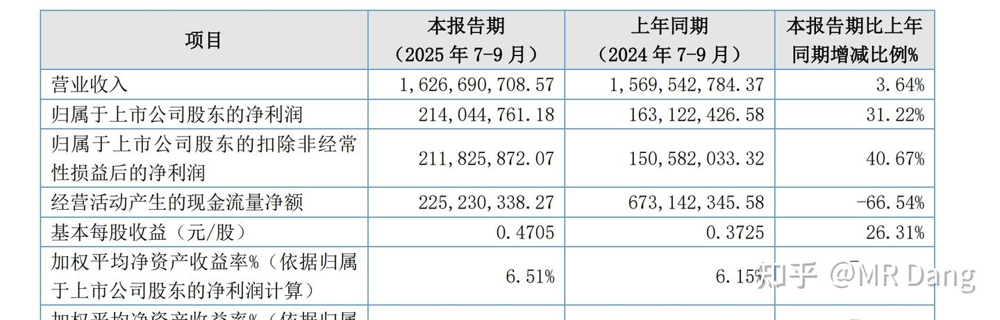
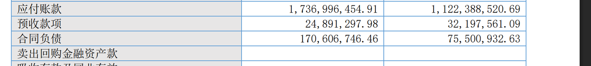

# 《邪修大法》时来天地皆同力——T公司投机价值分析

---

**发布时间**: 2025-10-29 08:58  |  **原文链接**: https://zhuanlan.zhihu.com/p/1965092879585248005  |  **点赞数**: 182 人赞同

**作者信息**: MR Dang​独立投资人，全网无其他平台，无小号无私域，不接广不卖课

---

## 正文内容

邪修之法，风险巨大。

所为以正合，以奇胜。

即使是邪修，也应有深厚之内力，方可降低走火入魔之风险，

需搭配正派地阶心法为前置：

[[20251023-《地阶功法卷二》价值投资三大误区|地阶功法卷二]]

[[20251022-《地阶功法卷一》投资者必须斩杀的三个妄念|地阶功法卷一]]

邪修风险告知：（请务必重视）

1.本研究对象处于北交所，单向波动幅度30%一天，若天地板，则高低一天最多波动80%以上，风险极高！！

2.本研究对象一天成交量有限，流动性不足，若跟风买入，很容易造成短时间内的价格冲击，被套在山顶！！

3.本研究对象的应收账款余额较大，现金流一般，有一定的财务风险！！

4.本人持有相关头寸，若短期价格涨幅过大会进行售卖！！！

5.相关标的年内涨幅接近70%！！

丑话都说在前头了，现在开始正文：

熟悉我的诸位道友，应该知道我的爱好，银行，化肥，化工，有色，煤化工这些傻大黑粗。

在研究[[20251024-《天阶功法卷一》BFNY价值投资分析|BFNY]]的时候，我注意到BFNY在新疆有远期400万吨级烯烃的远期产能规划。

这里面肯定有投机机会。

首先是最直接的，400万吨级烯烃对应的标准煤需求大约为2000万吨/年，算上其他公司的在建产能，最终对应的煤需求在6000万吨/年的级别。

考虑到BFNY的产能落地地区为准东地区，我逐一考察了准东附近的坑口。

准东附近的坑口怎么说呢，最大的产能接近亿吨级，依托自动化开采技术，开采成本可以压缩到80元/吨，而且产量极大。

但是又带来了新的问题，准东地区附近的煤矿上市公司有关的是特变电工，特变电工这个我熟啊，涨的太多了，不想追，而且准东的煤矿在特变电工的业务里含量占比不是非常高。

直接投新疆煤炭这条路看起来不好走，而且煤炭周期性太强，不容易把握。

那么就没有投资机会了么？

有的，兄弟，有的。

前面的粗体字看见了么，"依托自动开采技术"

大家要想一个问题，新疆的煤矿大多都是露天煤矿，煤炭就在地上躺着。

所谓的自动开采技术肯定不能只是技术，而是一定有物理介质存在的，煤总不能自己飞出来吧？

我们分析一下，煤炭自动开采技术有哪些东西：

1.智能开采装备：电铲类

2.AI地质建模：服务类

3.无人矿卡：车类

4.工业软件平台：软件类

主要就是这四部分。

好了，现在我的挑选范围就是：

1.主营业务在以上4个范围，并且比例越高越好.

2.主营地区在新疆的煤矿，比例越高越好。

3.估值不要太高了，最好比行业平均低

4.前景要好，增速要高

5.祖国母亲鼓励支持

6.最好有点股息，投机套死了起码能回点血。

7.要符合时代底色，含有一定的科技属性，要有故事可讲。

8.要符合安全的要求，不管是能源安全还是资源安全还是科技安全，总得靠一头。

以上要求不是需要全部满足，但是最好是满足的越多越好。

有人要说了，这么多要求，怕是没有公司能符合吧，这简直相当于直接报身份证号码了。

有的，兄弟，有的。

当我从主板一无所获，从两创铩羽而归，目光不经意的扫过北交所时。

有那么一瞬间，这支股票就仿佛一束光闪烁着丁达尔效应的光芒，穿透了迷雾，直接啪的一下，打在了我的脸上。

我知道，是时候投机了。

这个公司是干什么的呢？

简单的说，就是卖车的。

卖的什么车？

主要是挖矿要用到的小矿车。

当然所谓的小也不是真的小

卖家秀长这样：

买家秀长这样：（我曾经的爱股XX矿业的铜矿所在地）

总之，就是在矿区里的烂地里行走的小车车，普通的售价100万,能拉100吨左右，电动无人版本大概200万。

在这个十分细分的赛道里，T公司是这个赛道的TOP1，是真龙头，是全球的开创者，也是领先者，市占率30%，和LG一起形成了寡头垄断的格局。

同时，他的竞争对手除了同行业的小车车，还有大车车，长这样:

这个大车车大概是200吨的载重，相当于两个小车车。

价格是2000万，相当于10-20个小车车。

好，那么现在聪明的你已经看出来了，小车车的优点非常明显：便宜。而且不是一般的便宜，是无与伦比的便宜。

同时因为它便宜，所以质量耐久性差一点很合理吧，一般工作3到5年就要更新换代了。

总结一下，T公司的优势：

1.细分赛道龙头，市占率领先。

2.主要销售地区煤炭产量缓慢增加，且未来远期需求有巨大提升空间。

3.产品便宜，性价比高。

4.更换周期短，2021年保有量将近2万台，到今年基本已经要更新换代了，以前的需求还在，每年还有新增需求。

T公司的产品不是一个耐用品的属性，而是更接近消耗品的逻辑，需求稳定。

以上4个优点只是T公司的基本盘，除此之外还有两个渗透率提高逻辑：

1.电动化渗透率的提高推动毛利率和营收双增长。

电动化小车车可以省油，对矿场来说生命周期内性价比更高，是祖国母亲鼓励的方向。

对T公司来说电动车的毛利率更高。

2.无人化渗透率的提升推动毛利率和营收双增长。

一个车一般要配最少两个人，单人平均年支出15万以上，一个车人工支出30万是最起码的，矿场危险，经常还有意外发生。

如果无人化后，矿场只需要从100万升级成200万，按照5年的生命周期，每年支出仅多20万。

而对T公司来说，二者的成本差距并不大，毛利率提高明显。

除此之外，T公司还有两个小逻辑：

1.保有量提升后，维修费用收入保持稳定，并稳步增加。

2.由于良好的合作关系以及配套设施的沉没成本，客户粘性极高，目前正在积极跟随国企在海外开展业务。

估值情况：

由于赛道过于小众，目前的直接对标标的上市公司只有BFGF一家。

北交所的流动性不足，而恰好BFGF在股价高位，目前动态的估值是T公司的两倍。

和同业相比，T公司估值较低，但是考虑到主板本身的流动性溢价，也算合理。

和自身相比，目前的市盈率TTM处于70分位值，算是较高的水准，所以这是我称T公司为协修的判断依据之一。

若股价处于30分位以下，也就是7.2PE，折合股价大约14到15之间，则以T公司的质地，可以称为价值投资。

三季报情况:

前三季度营业收入和新疆地区煤炭产量数据基本可以对的上，印证猜想基本正确，因为这个交付和产量之间肯定有时间差和结算的问题，差距几个点以内很正常，看大方向。

不足之处，是销售回款不佳，公司解释是销售单价提升，矿场压力大，使用了现金流更少的支付方式（如融资租赁），基本有一定可信度，但还须观察印证。

Q3净利润同比+31%，扣非+40%。

第三季度的毛利率有所提升，猜测是电动化无人化带来的附加值提升。

合同负债大幅增加，显示在手订单较多，四季度交付后可结算为收入。

风险再次提示：

1.北交所是冷门交易所，T公司所在行业为冷门行业，北交所的涨跌节奏和主板不一样，有自己的规律，贸然参与很可能坐多年冷板凳。

2.T公司处于70估值分位，虽然和同行比估值相对便宜，但也存在一定风险。

3.T公司现金流不佳

4.成交量小且有做市商参与，贸然买进容易买入即套入！！！

5.今年涨幅巨大

而且很多读者都没有开通北交所权限，所以我建议大家看看逻辑就好，就当了解了一个冷知识吧，多看，多了解，少动，少参与。

一个喜欢保护韭菜的博主，希望大家少踩坑，多赚钱。

---

## 精选评论

> [!comment]- 点击展开评论
>
>
> | 用户 | 时间 | 内容 |
> | :--- | :--- | :--- |
> | endless-dy |  | 懂了，买不了T，还买不了徐工? |
> | 慕北 |  | 我也在看徐工..莫名其妙跌两天..是不是在给进场机会 |
> | 哈皮 |  | 刚接触投资，一个缩写也看不懂，全靠评论区的各位 |
> | 矿泉胡桃 |  | nl涨停了！我上午竟然犹豫没有买。但是想想就算上车也只敢买几千块钱，涨停又能怎样看了老师的地阶功法后思想钢印太强了（不懂不买不重仓），限制我通过抄作业灵活致富 |
> | Bboy小宇 |  | 一样 |
> | 十三郎Script丶 |  | 虽然买不了，这个研究逻辑不错，点赞！ |
> | 时倾 |  | 大佬我给你跪了昨天跟ns今天快涨停了 |
> | 123赵 |  | 昨天？ |
> | 123赵 |  | 这个自己决定哈，出也只能出半仓，今天买的要明天啦 |
> | 北枳 |  | tong力，报我身份证号得了 |
> | 易凌顷 |  | 那个老兄 说和全称首字母不？ 谢谢 |
> | Knx |  | tlrs |
> | 戈多走丢了 |  | 先点赞，后阅读，再收藏 |
> | Echo |  | 大佬辛苦了。大佬，我想知道在这篇文章下怎么送礼物呀？我每次送礼物都要找篇可以送礼物的按钮。 |
> | &nbsp;&nbsp;&nbsp;&nbsp;MR Dang |  | 我也不太会，随缘呗，送不了就算了。心意领了哈 |

---

*本文件由自动脚本从MR Dang知乎页面提取生成*

---

**作者**: MR Dang
**链接**: https://zhuanlan.zhihu.com/p/1965092879585248005
**来源**: 知乎

*著作权归作者所有。商业转载请联系作者获得授权，非商业转载请注明出处。*

---

## 相关阅读

**📖 邪修系列其他文章：**
- [[20251110-《邪修大法卷三》|邪修大法卷三]] - 军工电子元件投机价值分析
- [[20251030-《邪修大法卷二》寒王之上，应有新王——GDLZ投机价值分析|邪修大法卷二]] - 量子科技概念股的市梦率估值法
- [[20251120-《邪修心法卷一》真_择时大法|邪修心法卷一]] - 价值投资者的择时技巧

**📚 地阶功法系列：**
- [[20251022-《地阶功法卷一》投资者必须斩杀的三个妄念|地阶功法卷一]] - 投资者的三大心魔
- [[20251023-《地阶功法卷二》价值投资三大误区|地阶功法卷二]] - 价值投资的常见误区
- [[20251025-《地阶功法卷三》商业模式评估|地阶功法卷三]] - 如何评估商业模式

**⚔️ 天阶功法系列：**
- [[20251024-《天阶功法卷一》BFNY价值投资分析|天阶功法卷一]] - 宝丰能源价值投资分析
- [[20251026-《天阶功法卷二》BFNY估值方法|天阶功法卷二]] - 宝丰能源估值方法详解
- [[20251106-《天阶功法卷六》银行股投资原理详解|天阶功法卷六]] - 银行股投资原理详解

**💡 投资方法教育：**
- [[20251024-怎么全面的分析一支股票？|怎么全面的分析一支股票？]] - 股票分析框架
- [[20251026-如何对企业进行估值？|如何对企业进行估值？]] - 估值方法详解
- [[20251016-投资新手避坑指南之追热点(万粉特别奉献)|投资新手避坑指南之追热点]] - 追热点的风险

**🔙 返回系列总览：**
- [文章目录](/articles) - MR Dang 全部文章目录
