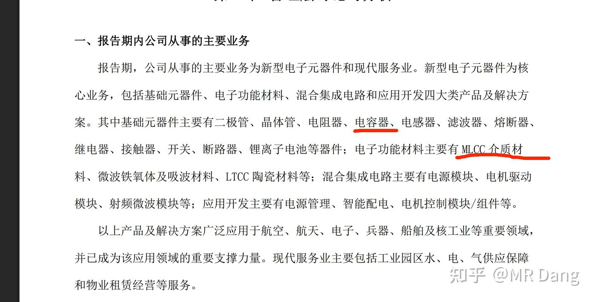
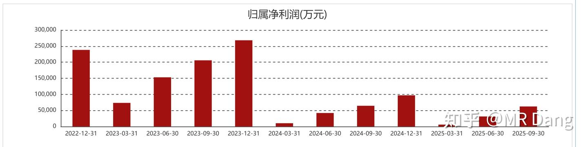
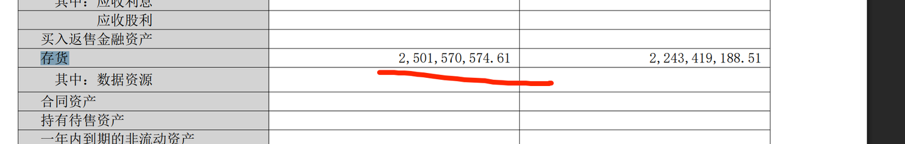
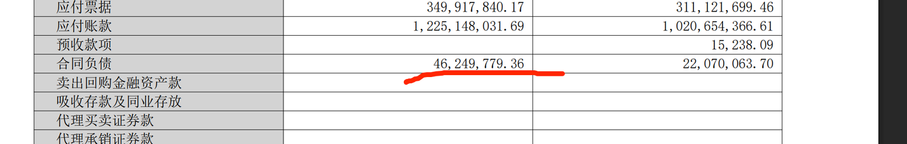
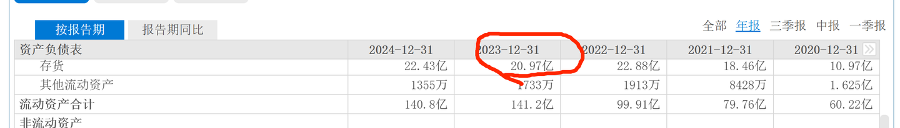
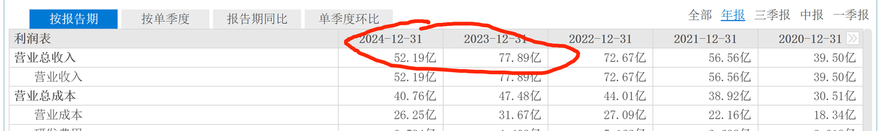
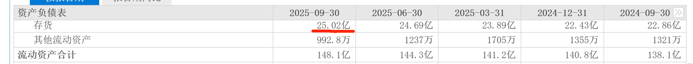
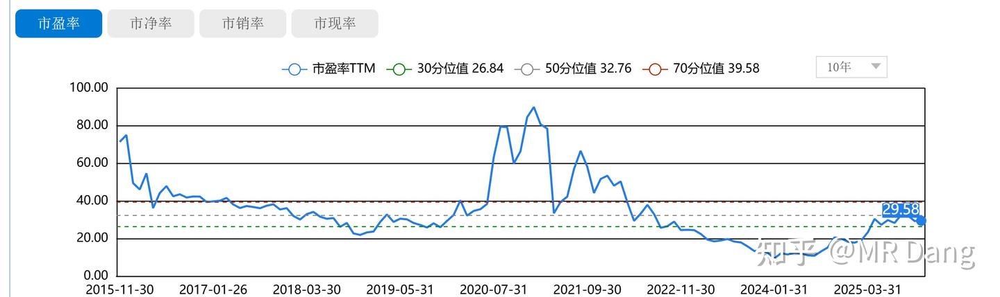
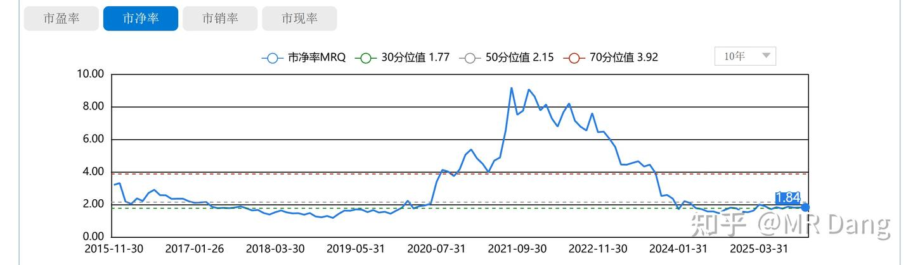

# 《邪修大法卷三》

---

**发布时间**: 2025-11-10 09:23  |  **原文链接**: https://zhuanlan.zhihu.com/p/1970775143807718089  |  **点赞数**: 301 人赞同

**作者信息**: MR Dang​独立投资人，全网无其他平台，无小号无私域，不接广不卖课

---

## 正文内容

好久没更邪修了，今天带来一个科技JG标的。

我个人不喜欢科技股，不喜欢的原因有这么几点：

1.贵，估值高，好的都贵，便宜没好货。

2.股东回报做的不好，股息率低，拿着睡不好觉。

3.信息差很大，不是资深业内人士，对科技公司所处的生态位没有深刻的认识。

有些关键的产品或者行业信息，在股价异动很久之后才会被散户知道，非常被动。

4.最重要的一点，科技树的不确定性。

很多关键节点，技术路径一旦选择错误，一个公司甚至一个行业就直接灰飞烟灭了。

甚至于，哪怕公司的技术路径选择对了，但是如果别的公司在其他方面有科技突破，一个看起来蒸蒸日上的行业说没就没了。

就比如光伏，一开始要选择单晶硅或者多晶硅，选错了在商业竞争上就输了。

后来又要选N型料还是P型料。

一环套一环，压错技术路线，就是万劫不复。

以上四点，是我不选科技股的原因。

如果一个科技股能打消这4点疑虑，那我会觉得是非常好的选择，可入天阶功法作为价值投资标的。

如果有一个科技股不符合其中的一两条，但是其他两三条可以打消我的疑虑，那么我觉得可以视情况进行投机。

比如之前的[[20251030-《邪修大法卷二》寒王之上，应有新王——GDLZ投机价值分析|GDLZ]]，没有信息差，大家都是玄学炒股。

技术路径有国内TOP1的专家保障，算是打消了两点疑虑。

我个人也不喜欢JG股，不喜欢的原因是：

1.信息不透明，JG属于特殊行业，看个财报基本上属于看了，但是和没看也没多大区别。

2.商业模式不好，下游是最强势的需求方，面对上游也没啥大的议价权，基本上属于1求的商业模式。

3.JG股这么多年了，里面从来没出过那种一眼看过去，业绩连年上涨让人放心的品种。

即使是Jg股里的龙头，比如ZHCF，业绩也是大幅变动。

4.估值高，贵，不是一般的贵，我印象里JG股都是百倍PE满天飞，50PE是常态。

那以我的审美，没有可以投的jg股了么？

有的，兄弟，有的。

其实就是看新闻的时候，有个按钮新闻。

这种报道是极为罕见的，不懂新闻采编的人可能不知道里面的弯弯绕绕。

它至少解决了投资科技股的一个难点——就是技术路径的选择。

也解决了投资JG股的一个难点——需求的稳定。

电磁弹射它不可能只在003上发光发热，一定是有更大的应用前景的。

比如SC舰以及在建的004

而如果一旦确定了电磁弹射这个投机方向，那就绕不开超级电容这个关键节点，当然相似的重要节点还有中压直流技术。

嵌入我们的安全主线，逻辑就是：

安全→国防安全→电磁弹射→超级电容/中压直流→相关标的

标的选择：

超级电容一般用的是钽基电容，原理是利用钽表面生成的五氧化二钽形成一个电容整体。

相比起普通的电解液电容，因为没有液体介质，所以更稳定。

也不会有蒸发之类的隐患，更耐高温，寿命长，体积小，容比高。

缺点就是对电压电流敏感，所以003要搭配中压直流的技术。

中压是对电压的技术要求，直流是对电流的技术要求。

可以理解成好用，物理性能上耐用，电学性能上娇贵。

上游的话，就是钽，DFTY，有色标的，涨了不少了，不建议哈。

下游的军工股的话，超级电容方向，两个巨头，一个HDDZ，一个ZHKJ。

中压直流方向是ZGDL，我个人对这个标的有点偏见，就不提了。

HDDZ和ZHKJ两个都属于电容行业的龙头：

HDDZ更存粹，营收的80%都是电容，相对来说估值也更贵，50PE和3.5PB.

ZHKJ更全面，除了电容外，还有其他两用的电子元件，30PE和1.8PB.

仅看PB的话，ZHKJ甚至说不上有多贵，在科技股和JG股里算的上咬咬牙还能买的东西。

我个人喜欢便宜的东西，所以这里就选了ZHKJ，简单的拉一下数据：

主营里有电容，以及MLCC，这个也是高端需要进口的元器件，在电子工业里很重要，有故事可以讲的。

以前也是阔过的，最后因为种种原因吧，比如集采以及其他风暴什么的，市场竞争加剧，业绩就不太行了。

但是，今年的三季报，有筑底和边际反转的迹象。

同比环比都有好转，同时两个关键数据

合同负债和存货都有边际改善迹象:

这里解释一下啊，JG企业和普通企业不同，存货是越多越好，都是有了订单才生产的，合同负债和存货就是营业收入的前瞻指标。

比如ZHKJ的存货：

在2023年的年报中首次下滑

次年在2024年的营业收入就下降了。

单看季度存货数据的话，目前连续几个季度存货在缓慢增加，合理猜测可能行业低谷已经过去，未来交付结算可以期待一下。

另外最近还有钽电容涨价的新闻，和AI产业的需求有关。

看市盈率估值的话，处于10年来30分位和50分位之间，属于相对便宜，但不是最便宜的时候。

市净率估值也是相同的结论。

没了，就这没一点需要关注的内容，JG股的好处是没有信息差。

你不知道，我不知道，他也不知道。

有信息差的都是手眼通天的本事，这钱该人家挣。

所以虽然不完全符合我的审美，但是符合模糊的正确这个点。

具体到ZHKJ这个股，模糊的正确有哪几个点呢？

1.福建那边的预期，我觉得目前这个位置这个估值配一点JG股，比如5%吧，说的过去。

虽然现金回报很差，但是万一呢，算是个小彩蛋吧。

2.看目前8%左右的J费增长，以及信息化，电子化的大趋势，ZHKJ作为JG里面的电子元件龙头，大的趋势还是向好的。

3.电磁弹射的普及可能要超预期，后期的维护以及新搭载的情况值得期待。

风险提示：

1.再怎么说也还是遮盖不了估值贵的缺点，现金回报极差。

2.股价波动太大了，持股体验不好。

3.行业竞争格局不好，竞争激烈，毛利率承压。

4.商业模式不好，对下游议价权极差，上游成本刚性。

5.财报透明性低，确定性低。

6.今天可能会有个小高开，高开一般容易配套低走剧本，谨防被套。我个人不是作为短期题材炒作的目的。

吐了，改到第5遍了，能发出去么？

---

## 精选评论

> [!comment]- 点击展开评论
>
>
> | 用户 | 时间 | 内容 |
> | :--- | :--- | :--- |
> | 好像没有读过书 | 13 小时前 | 我承认我没出息，一直往下拉，光想抄作业，不想学习！ |
> | 一不小心 | 12 小时前 | 我也是，高开低走后，赶紧买入 |
> | 财运杠杠的中年男 | 8 小时前 | 大佬，YTKG还没走吧？ |
> | 坂田铖时 | 9 小时前 | Dang老哥，这次是我的专业领域了，JG这方面，目前国内利好的方面是全部国产化替代，所有器件，所有，阻容芯片全部要求使用国产，外资甚至合资都没有办法通过产品的设计评审。坏处就是，利润压低的发指，J代表直接对照你的产品明细，要你把一个螺钉的价格都写得清清楚楚，算完总价后，以全部产品105%的价格采购，也就是只给下游留5%的利润，你的一切房租水电人工设计，都在这5%里。哪怕JG这个领域的龙头，都没法完全靠J费养活，必须要额外拓展民用市场。说了这么多总结就是JG目前的市场不是很好，有其他那么多的好标的，JG能别碰就尽量别碰。 |
> | &nbsp;&nbsp;&nbsp;&nbsp;MR Dang | 8 小时前 | 小点声 |
> | &nbsp;&nbsp;&nbsp;&nbsp;MR Dang | 9 小时前 | 是，没议价权，以前不想碰，这次配点算是风格上的再平衡 |
> | 坂田铖时 | 8 小时前 | 然后就被套了？ |
> | 小搬砖工 | 2 小时前 | 除了财务分析，a股还有情绪炒作，周六女鬼子发表错误言论外交部今天强势反击了，明天jg能不能撑撑场呢 |
> | 第五槐序 | 13 小时前 | 大佬你真的没有自己去拉涨停好涨粉么 |
> | momo | 12 小时前 | 佬，你就是神，大爱，无私 |
> | &nbsp;&nbsp;&nbsp;&nbsp;MR Dang | 12 小时前 | 哪有那大本事 |
> | 懂你 | 13 小时前 | 准时，感谢赐予知识的力量 |
> | 长久 | 11 小时前 | 资金不够，还是等等天阶功法吧 |
> | &nbsp;&nbsp;&nbsp;&nbsp;MR Dang | 11 小时前 | 对，不要整邪修 |
> | 迎着太阳吹吹风 | 11 小时前 | 明白了，这就去买中核科技 |
> | &nbsp;&nbsp;&nbsp;&nbsp;MR Dang | 11 小时前 | 啊祖，你快住手 |
> | 向北 | 11 小时前 | 振华啊朋友 |
> | 在齐太史简 | 11 小时前 | 云图5个点出货，水下加到dsl。 |

---

*本文件由自动脚本从MR Dang知乎页面提取生成*

---

**作者**: MR Dang
**链接**: https://zhuanlan.zhihu.com/p/1970775143807718089
**来源**: 知乎

*著作权归作者所有。商业转载请联系作者获得授权，非商业转载请注明出处。*

---

## 相关阅读

**📖 邪修系列其他文章：**
- [[20251030-《邪修大法卷二》寒王之上，应有新王——GDLZ投机价值分析|邪修大法卷二]] - 量子科技概念股的市梦率估值法
- [[20251029-《邪修大法》时来天地皆同力——T公司投机价值分析|邪修大法卷一]] - 北交所矿车龙头投机价值分析
- [[20251120-《邪修心法卷一》真_择时大法|邪修心法卷一]] - 价值投资者的择时技巧

**📚 正派功法系列：**
- [[20251022-《地阶功法卷一》投资者必须斩杀的三个妄念|地阶功法卷一]] - 投资者的三大心魔
- [[20251023-《地阶功法卷二》价值投资三大误区|地阶功法卷二]] - 价值投资的常见误区
- [[20251024-《天阶功法卷一》BFNY价值投资分析|天阶功法卷一]] - 宝丰能源价值投资分析

**⚔️ 玄阶功法系列：**
- [[20251112-《玄阶功法卷一》农业茅台GGGF投资价值分析|玄阶功法卷一]] - 国光股份投资价值分析
- [[20251114-《玄阶功法卷二》谨慎吃饼——YTKG投机价值分析|玄阶功法卷二]] - 钾肥投机价值分析

**🔙 返回系列总览：**
- [[MR Dang/dang_articles/README.md|文章目录]] - MR Dang 全部文章目录