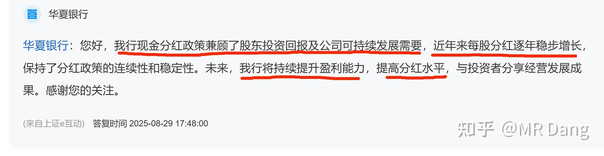
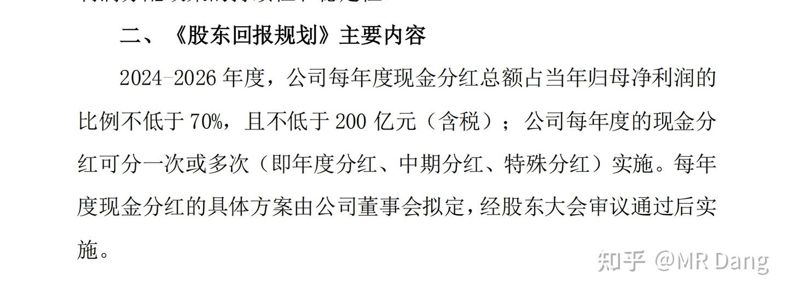

# 新手投资者避坑指南之测算股息率

---

**发布时间**: 2025-10-31 07:48  |  **原文链接**: https://zhuanlan.zhihu.com/p/1967253746468758684  |  **点赞数**: 217 人赞同

**作者信息**: MR Dang​独立投资人，全网无其他平台，无小号无私域，不接广不卖课

---

## 正文内容

本文较为新手向，但是鉴于经常碰到此类问题，就手把手的教大家如何测算股息率。

全网独家秘笈，再也找不到第二家。

第一步：分类讨论

先纠正大家一个观点啊，我们要算的是预期股息率，而不是什么过去的股息率。

过去的股息率有什么用啊？已经分出去的钱和你有什么关系么？

凡是让你看去年分了多少，然后➗股价的，统统拉黑，纯纯误人子弟哈。

在测算预期股息率的时候，先把公司分类一下：

这里有个词叫派息率，什么意思呢?公司挣了100块，分给股东30块，就是30%派息率。

和股息率不是一个概念，股息率是你花了100块买股票，每年公司给你5块分红，5%股息率。

我建议大家搞价值投资的时候，最好买A类企业，如果便宜，也可以买B类和C类，但是尽量不要买D类企业。

A类企业代表：银行，公用事业（水电，气，部分油），电信，铁路（大秦铁路），茅台等。

B类企业代表：海运，除茅台外白酒消费，煤，有色，化工等。

C类企业代表：火电，部分油，水务，燃气，纺织，家电，高铁等。

D类企业代表：投资新手不要碰，怕你把握不住。

这些划分不是绝对的，是实时变化的。

通常A类的平均股息率会低一些，因为确定性强。

B和C类的平均股息率会高一些，因为确定性不够，要用股息率作为补偿。

如果你发现一个A类企业，股息率还高，请不要犹豫，先买了再说。

第二步：测算基准

A类：算出最近两年的平均派息率并测算业绩。

以ZSYH为例:2023年33.92%，2024年33.99%。平均大约33.95%

业绩你预测不了就按照前三季度来，同比基本没变，那你预测去年的5.66没大的毛病，今年银行整体差一些，你再留个余量，按照5.6算就行了。

5.6*0.3395=1.9

1.9/41.2=4.61%

B类：

以ZYHK为例：2023年49.74%，2024年49.4%，平均大约49.6%。

业绩你自己不要算了，普通投资者总不能天天盯着SCFI和油价算业绩，前三季度1.74，ZYHK一般第四季度业绩都一般，随便猜一个数字，按照0.3算就行，全年2.04

2.04*0.496=1.01

1.01/14.88=6.8%

（所以经常有新来的投资者问说ZYHK10%的股息率能不能买，其实根本达不到的哈）

C类：

以HDGJ为例：2023年33.93%，2024年39.21%，平均大约36.57%

业绩一致性预期是0.6

0.6*0.3657=0.22

0.22/5.53=4%

第三步：行业基准纠正

如果你把前两步轻松的完成了，此时你已经是一个合格的会计了，恭喜你算出了预期基准股息率。

但是距离价值投资者还差一步，就是第三步的行业基准纠正，这是精髓所在。

怎么纠正呢？

你有没有发现第二部的计算原理基本上是一致的，那分类的意义是什么呢？

就是为了分类去纠正算出来的基准。

A类：

A类企业为什么分红稳定？

因为它盈利能力稳，处于成熟期，又有健全的制度。

每年就是赚钱，然后开会，然后分红，惯性很强。

所以一般不需要纠正，除非有外力。

比如考核目标，比如管理层表态。

你需要去揣摩管理层公开的文字表达。

比如我重点跟踪的HXYH:

大家体会一下什么叫提高分红水平，什么叫保持连续性和稳定性？

2022年每股0.383，2023年每股0.384，2024年每股0.405，2025年应该分多少呢？

你算出来如果低于0.4，它会合理么？

所以这种情况就需要纠正。

B类：

B类企业派息率稳定，但是为什么业绩不稳定？

说明公司治理非常现代化，利润的现金流很充足，但是所在的行业周期性太强。

这类企业有个特点，他会有周期焦虑。

什么意思呢，就是如果业绩不好的时候分50%，突然有一年大周期来了，他的派息率大概率是低于50%的，公司会倾向于屯一些现金，到周期底部的时候释放分红，平滑周期波动。

你在上面测算的基础上，就要根据周期情况进行合理的基准纠正，周期顶部的时候下调一点派息率，周期底部反而可以上调一点预期。

当然这只是一种经验，具体标的还要具体分析。

C类：

C类企业业绩稳定，为什么分红不稳定？这类企业一般会根据需要有大额资本开支，比如要建设新的产能，或者提前囤积原料，或者并购，或者投资。

你如果在公告里看见它又要收购XX，又要在XX哪里巨额投资，那你就要下调派息比例了。

相反，如果它天降横财，出售了XX业务，或者把持有XX股票处理了，那大概率就要分红了，可以适当上调派息比例。

第四步：大股东需求纠正

第三步完了之后，还需要考虑大股东的诉求。因为大股东的诉求重要性更高，所以放在第四步，去纠正第三步的结果。

如果大股东急需用钱，但是又没有减持股票，很可能通过加大派息率来达到目的。

比如这次NSLY就是如此。

有些股东不是大股东，但是属于重要的财务投资者，在投资的时候和大股东或者公司都是有约定的，也要提高派息率的预期。

第五步：公告纠正

这步的确定性是最高的，很多公司为了安抚投资者，推出了很多提振派息的公告，所以放在最后一步进行纠正。

比如酒企WLY:

每年派息率不低于70%且不低于200亿。

若业绩低于7.36，则每股派息≥5.15

若业绩高于7.36，则每股派息≥业绩*0.7

5.15/118=4.4%

WLY最低股息率4.4%

另外多说一句，WLY的商业模式和行业前景在酒企里还是可以的，帐上的现金很多，现在三季度业绩不佳，但是可以蹲一个困境反转的机会，价格合适还是值得入手的，价值投资就是在保证价值的情况下人弃我取。

一个喜欢保护韭菜的博主，希望大家少踩坑，多赚钱。

---

## 精选评论

| 用户 | 时间 | 内容 |
| :--- | :--- | :--- |
| 玉园 |  | Dang佬，你的文章我一天想看十篇，天天发这一点点不够看我会太想你的 |
| forward |  | Dang总，你这样真的是男女双杀，真的很难让人不爱上你 |
| &nbsp;&nbsp;&nbsp;&nbsp;MR Dang |  | 谢谢 |
| 财运杠杠的中年男 |  | 哈哈哈，同感 |
| 天高气爽风飞扬 |  | 每次学完，就到炒股的朋友那成功装逼 |
| 不知道 |  | 来了来了 |
| 用圭 |  | 带佬这个分析太强了，我之前能意识到不能用历史股息率来看，我都是去查股东回报规划然后去算的，但是有些企业没有，我就只能粗浅地乘一个系数了。我感觉带佬的描述要准确了好多 |
| 老赵 |  | 今天4000家红，我全绿 |
| &nbsp;&nbsp;&nbsp;&nbsp;烟色系 |  | 讲到了我一直想了解的知识，谢谢作者大大！ |
| 从伊而终 |  | 老师，为什么我算出来招商银行2024年业绩是5.88，是用2024年利润÷总股本吗？ |
| 花花子 |  | 大佬5.6是代表什么？年利润吗。 |
| 赵日天不太服 |  | 每股收益 |
| 风中的柠檬香味 |  | 大佬 为啥股息率计算不考虑股份数量 |
| 你猜 |  | 按照你的买入金额和分红的钱的比值算所以和股份数量应该没关系吧。 |
| vivi |  | dang总，如果第三季报有预案分红方案是不是可以按预案来？ |
| &nbsp;&nbsp;&nbsp;&nbsp;MR Dang |  | 那肯定的啊 |
| vivi |  | 谢谢 |

---

*本文件由自动脚本从MR Dang知乎页面提取生成*

---

**作者**: MR Dang
**链接**: https://zhuanlan.zhihu.com/p/1967253746468758684
**来源**: 知乎

*著作权归作者所有。商业转载请联系作者获得授权，非商业转载请注明出处。*
